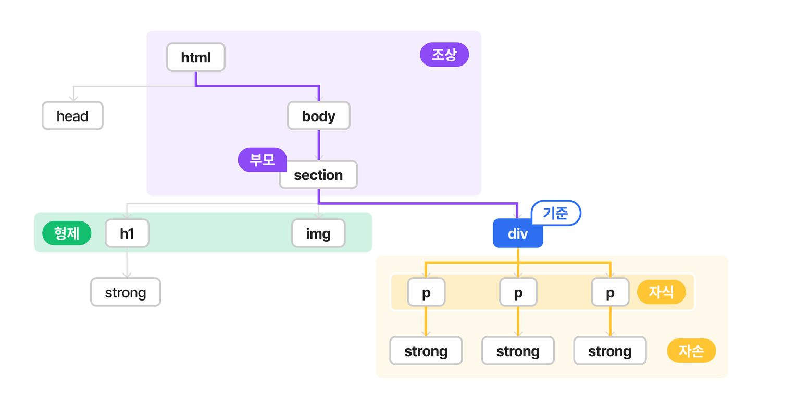
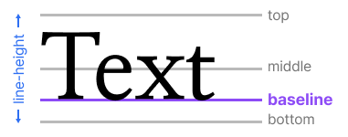

모든 출처
이스트소프트 백엔드 개발자 부트캠프 오르미 5기

# HTML 용어 정리🚩

🗒️ 요소(Elements): HTML의 기본 구성


- 태그(Tag)
    - 웹 문서에서 각각이 무엇을 의미하는지 정의
    - 일반적으로 태그들은 시작(여는) 태그 `<>` 와 종료(닫는) 태그 `</>` 로 구성되어있으나, 빈 요소 `<br> <input> <image>` 등은 닫는 태그 없이 사용한다.

<aside>
💡 HTML의 경우, 오류를 알려주지 않고 웹브라우저가 임의로 결과를 보여줍니다.
’웬만한 오류는 알아서 처리해준다.’가 좋은 것 같지만, 예상치 못한, 의도하지 않은 화면이 될 수 있습니다! 
이런 것을 방지하고 싶다면 마크업 검사를 진행해 주세요.

[**Markup Validation Service**]

[Markup Validation Service](https://validator.w3.org/)

</aside>

🗒️ 주석

- `<!-- 주석 -->` 와 같이 사용
- 주석을 이용하여 각 코드에 대한 설명을 작성하며 프로그램 동작에 영향을 미치지 않는다.
- 작성 이유: 실수 방지, 원활한 소통, 나의 기억력을 믿지 못해서…ㅎㅎ
- 예시

```html
<!-- start -->
<!-- //end -->

<!-- form -->
<form>
	...생략...
</form>
<!-- //form -->
```

```html
<!-- 휴대폰번호 인증필요 -->
<input type="tel">

<!-- #2022.02.20 4:00 업데이트 -->
```

```html
<!-- 신청기간이 아니여서 임시 주석처리
	<a href="#">신청페이지 바로가기</a>
-->
```

🗒️ 부모, 형제, 자식, 자손 관계



```html
<html>

<head></head>

<body>
  <section>
    <h1>
      <strong></strong>
    </h1>
    
    <div>
      <p><strong></strong></p>
      <p><strong></strong></p>
      <p><strong></strong></p>
    </div>
  </section>
</body>

</html>
```

# HTML 기본 구조 🦴

```html
<!DOCTYPE html>
<html lang="en">
<head>
  <meta charset="UTF-8">
  <meta http-equiv="X-UA-Compatible" content="IE=edge">
  <meta name="viewport" content="width=device-width, initial-scale=1.0">
  <title>Document</title>
</head>
<body>
  
</body>
</html>
```

## 1. `<!DOCTYPE html>`

- Document type Definition(DTO)로 문서의 타입에 대한 정보 제공 및 어떤 모드로 페이지를 렌더링할지 결정

## 2. `<html lang="en"></html>`

- HTML 문서의 루트, lang 속성을 통해 주 언어 설정
- 언어코드(소문자)-국가코드(대문자)

| 언어코드 | 언어 | 국가코드(국가) |
| --- | --- | --- |
| ko | 한국어 | KR(대한민국), KP(북한) |
| en | 영어 | US(미국), GB(영국), PH(필리핀)  |
| zh | 중국어 | CN(중국), HK(홍콩), TW(대만), Hans(간체), Hant(번체) |
| ja | 일본어 |  |
| de | 독일 |  |
- 주 언어 설정은 검색엔진, 스크린리더가 음성 표현에 사용할 언어 선택, 번역 기능 제공 등에 영향

## 3. `<head></head>`

- 기계가 식별할 수 있는 문서 정보(메타데이터) 포함
- 검색엔진을 위한 다양한 정보가 들어있음
- 사용자에게는 title, favicon(홈페이지의 사진), viewport 등이 보여짐
- `<meta>` : 어떤 목적을 위해 만들어진 데이터로 검색엔진에서 사용됨
    - charset: 문자 깨짐 오류 방지를 위해 문자 코드의 종류를 설정

    ```html
    <meta charset="utf-8">
    ```

    - http-equiv="X-UA-Compatible" content="IE=edge": 각 페이지 별로 다르게 보여지지 않도록 브라우저 호환성을 위해 작성

    ```html
    <meta http-equiv="X-UA-Compatible" content="IE=edge" />
    ```

    - viewport: width를 통해 너비를, initial-scale을 통해 확대/축소 수준 제어(0.1 ~ 10, 기본 1)

    ```html
    <meta name="viewport" content="width=device-width, initial-scale=1.0" />
    ```

- `<title></title>`
    - 브라우저의 제목 표시줄이나 페이지 탭에 보이는 문서 제목
    - 검색엔진: 인터넷을 사용하는 사용자가 제목을 보고 탐색할 페이지 선택
    - 페이지마다 60자 이하의 적당한 제목이 노출되도록 개발!
- `<link>`
    - 현재 문서와 외부 리소스의 관계 명시
    - 스타일 시트, 폰트, 파비콘 연결 시 사용
    - rel=”파일의 속성”, href=”파일의 위치”

```html
<head>
  <!-- 스타일 시트 링크 -->
  <link rel="stylesheet" href="style.css">
  
	<!-- 폰트 링크 -->
  <link rel="stylesheet" href="font.ttf">
  
	<!-- 파비콘 링크 -->
  <link rel="shortcut icon" href="favicon.ico"> 
</head>
```

## 4. `<body></body>`

- 사용자에게 보이는 영역

# HTML 태그📒

📌 블록 🆚 인라인 레벨 요소

|  | block             | inline                                    | inline-block |
| --- |-------------------|-------------------------------------------| --- |
| 설명 | 페이지의 구조적 요소를 나타낼 때 사용 | 항상 블록 레벨 요소 내에 포함                         | 인라인과 같은 배치를 가지나 블록처럼 크기 조절 가능 |
| 부모 요소 공간 | 전체 차지             | 자신의 컨텐츠 크기만큼만 차지                          | 자신의 컨텐츠 크기만큼만 차지+조절 가능 |
| 요소 포함 | 인라인 요소 포함 가능      | 블록 요소 포함 불가 <br/> (a 태그만 가능)              | -                   |
| 줄바꿈 | O <br/> (세로로 쌓임)  | X <br/> (가로로 쌓임) | X  <br/> (가로로 쌓임) |
| width, height | O                 | X                                         | O |
| padding | O                 | O                                         | O |
| margin | O                 | △ <br/> (left,right만 적용 / top,bottom 적용 X) | O |
| border | O                 | O                                         | O |
| 해당 태그 | `<div> <p> <form>` | `<span> <a> <label> <input> `               |  |


```html
<!-- O -->
<div>
	블록요소 안
	<span>인라인요소 중첩 가능</span>
</div>

<!-- X -->
<span>
	인라인요소 안
	<div>블록요소 중첩 불가능</div>
</span>
```
<pre>
<aside>
💡 인라인요소 중에 a 태그의 경우, 안에 블록 요소 중첩 가능합니다!
<code> &lt;a href="#"&gt;&lt;div&gt;&lt;/div&gt;&lt;/a&gt; </code>
</aside>
</pre>

## `<div>`

- 콘텐츠 분할 요소, 여러 태그들을 그룹핑 하기 위한 태그
- 블록 요소
- 스타일 적용을 위한 용도로 사용 권장

## `<span>`

- 인라인 요소

CSS로 스타일을 주기 전에는 콘텐츠나 레이아웃에 어떠한 영향도 주지 않습니다.

---

## Sections

## `<header>`

- 소개 및 탐색에 도움
- 회사명, 제목, 로고, 검색 폼, 작성자 이름 등의 요소를 포함
- 태그 중첩 불가, footer 태그를 안에 사용 불가

## `<main>`

- body의 주요 콘텐츠로 웹페이지 당 하나
- 사이드바, 탐색 링크, 저작권 정보, 사이트 로고, 검색 폼 등 여러 페이지에 반복되는 콘텐츠 포함 금지(단, 검색 폼이 주요 기능이라면 예외)

## `<footer>`

- 페이지의 작성자, 저작권 정보, 관련 문서 등의 내용이 담김

## `<nav>`

- navigation bar
- 문서의 부분 중 현재 페이지 내, 또는 다른 페이지로의 링크를 보여줌
- 사이트 전체 탐색 용 nav와 현재 페이지 내 탐색 용 nav 등 여러 개의 nav를 가질 수 있음
- 메뉴, 목차, 브레드크럼으로 사용

⭐ 브레드크럼: 사용자가 어떤 경로로 해당 페이지로 들어오게 됐는지 그 경로를 보여주는 것

- 메뉴

    ```html
    <nav>
    	<ul>
    		<li><a href="#">위니브</a></li>
    		<li><a href="#">About</a></li>
    		<li><a href="#">Contact</a></li>
    	</ul>
    </nav>
    ```

- 브레드크럼

    ```html
    <nav>
    	<ol>
    		<li><a href="#">위니브</a></li>
    		<li><a href="#">캐릭터소개</a></li>
    		<li>라이캣</li>
    	</ol>
    </nav>
    ```


## `<article>`

- 독립적으로 구분해 배포 및 재사용 가능
    - 사이트의 다른 기능에 영향을 주지 않고 독립적인 기능 수행
    - 아티클 영역을 제거해도 페이지는 정상적으로 작동
- 대표적인 예: 게시판, 블로그 글, 매거진, 뉴스 기사, 위젯, 실시간 채팅 창 등
    - 뉴스 홈페이지에서 다양한 기사들이 한 페이지에 담겨있지만, 이 기사들은 각각 독립적
    - 기사가 달라져도 홈페이지는 정상적으로 작동

## `<section>`

- 웹페이지의 앞뒤 문맥이 연결성이 필요하거나, 더 적합한 의미를 가진 요소가 없을 때 사용
- 그룹핑 용도지만 웹페이지에서 없어지면 안됨!
- 두 태그 모두 제목 요소를 자식으로 포함하여야 하며 그룹화

## `<aside>`

- 문서의 주요 내용과 간접적으로 연관된 부분
- 문서의 주요 흐름을 따라가지 않고, 보조적인 역할
- 각주, 광고 배너 등에 사용

## `<h1><h2><h3><h4><h5><h6>`

- 제목 태그 like 목차
- h1 ~ h6 순서대로 작성

## `<a>`

- 다른 페이지나 같은 페이지의 어느 위치, 파일, 이메일 주소와 그 외 다른 URL로 연결할 수 있는 하이퍼링크
- `href=""` 페이지 내 특정 위치(id 속성 이용) / 파일 / URL / tel: 전화번호 / mailto: 이메일 주소 등 입력 가능
- target 속성 값: _self 현재 페이지 / _blank 새 탭
- download: 링크 이동 대신 바로 대상 저장, 브라우저에서 열 수 있는 파일 포맷이라면 실행

```html
<a href="b.html">b.html으로 이동</a>
<a href="b.html" **target="_blank"**>b.html **새탭으로** 이동</a>
<a href="b.html" **download**>b.html 파일 **다운로드**</a>
<a href="**mailto**:google@gmail.com">mailto:google@gmail.com</a>
<a href="**tel**:010-0000-0000">010-1234-1234</a>

<!-- 페이지 내 특정 위치 이동 예시 -->
<a id="pos"></a>
<a href="#pos">pos id를 가진 위치로 이동</a>
```

## `<p>`

- paragraph의 약어로 하나의 문단, 블록 요소
- HTML에서 문단 = 이미지나 입력 폼 등 서로 관련 있는 콘텐츠

## `<strong>`

- 중대하거나 긴급한 콘텐츠로 단어 혹은 문장
- 스크린 리더를 사용하여 컴퓨터 화면을 낭독할 때 strong 사이에 있는 문자는 거센 억양으로 소리냄
- 굵은 글꼴 적용

## `<br>`

- line break의 약어로 줄을 나눈다는 의미, HTML이 엔터 값을 인식하지 않기 때문에 사용

## `<hr>`

- 단락 구분 시 사용(주제 변경 및 장면 전환을 의미)

## `<code>`

- 짧은 코드 한 줄을 나타낼 때 사용, 태그 사이에 코드 한줄 입력
- 텍스트의 고정 폭 글꼴(monospace font: 모든 문자가 동일한 너비를 가지는 글꼴)을 사용

## `<pre>`

- HTML에 작성한 내용 그대로 표현하는 태그
- 공백이 필요한 코드, 텍스트를 사용해 그림을 그릴 때 사용
- 텍스트는 고정 폭 글꼴, 공백은 유지됨

---

## 목록 태그

## `<ol>`

- ordered list의 약자, 정렬되고 순서가 있는 목록
- `type=""`  1 숫자(기본값) / a 소문자 알파벳 / A 대문자 알파벳 / i 소문자 로마 숫자 / I 대문자 로마 숫자

```html
<ol type="i">
  <li>Introduction</li>
  <li>List of Grievances</li>
  <li>Conclusion</li>
</ol>

<!--
i. Introduction
ii. List of Grievances
iii. Conclusion
--->
```

- `start` 아라비아 숫자로 정렬 시 시작할 숫자
- `reversed` 순서 역순 정렬

```html

<ol start="4" reversed>
  <li>Speedwalk Stu</li>
  <li>Saunterin' Sam</li>
  <li>Slowpoke Rodriguez</li>
</ol>

<!--
4. Speedwalk Stu
3. Saunterin' Sam
2. Slowpoke Rodriguez
-->
```

## `<ul>`

- unordered list의 약자, 비순차적 목록(지금처럼 불릿으로 표현됨)

## `<li>`

- 목록의 항목으로 `<ol> <ul>`의 자식요소로만 사용 가능

자식요소로는 li만!

```html
<!-- **X** -->
<ol>
	**<div>item</div>**
	<li>item</li>
	<li>item</li>
</ol>

```

자식이 아닌 자손요소로는 다른 태그도 사용가능합니다

```html
<!-- **O** -->
<ol>
	<li>item
			**<div>first item</div>**
	</li>
	<li>item</li>
</ol>
```

---

## Media

## `<image>`

- 문서에 이미지 삽입
- `src` 이미지의 위치, 경로
- `alt` 이미지 설명, 이미지를 불러오지 못했을 때 혹은 시각장애인을 위한 스크린리더에서 사용, 이미지를 대체하는 텍스트가 중복이면 따옴표 안을 비워둠

```jsx

```

<aside>
🤔 **이미지 하단에 빈 공간이 생겨요!**

해당 현상은 img가 **인라인 요소**라서 발생하는 현상입니다.

인라인 요소이기 때문에 img의 세로 정렬이 글자의 baseline을 따르게 됩니다.

또한 이미지를 텍스트로 인식함!




해당 현상을 해결하기 위해서는 아래와 같은 초깃값을 넣어주면 됩니다

```css
img{
	vertical-align:top;
}
```
</aside>